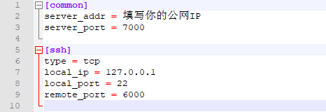

## 树莓派实时检测提示，不同局域网下结果回传终端Demo

## 硬件

树莓派基础套件、摄像头、蜂鸣器（蓝牙音箱）

## 文件结构
整体文件结构如下：
```
    for_win:
    	frp： (一种可用于内网穿透的高性能的反向代理应用)
            frpc.ini  (配置文件)
            frpc.exe  (启动frp)
            ...
		server.py  (通过socket来完成客户端数据接收)
    for_raspi
        Paddle-Lite：	
            include (编译好的Paddle—Lite的头文件)
            libs（存放armv7hf）
                armv7hf（编译好的Paddle—Lite的库文件）
        code：
            audio    (蓝牙音箱报警方法|音频存放地址)
            build
            docs
            labels   (预测标签)
            models   (模型文件)
            test：
                demo    (测试图片)
                results    (测试结果存放地址)
            screenshots   (实时检测结果图像存放地址)
            FileSystemEvent.py   (监控screenshots文件夹内动态)
            client.py   (通过socket来发送数据)
            play_audio.py   (播放提示音频)
            CMakeLists.txt 
            Detection_client.cc   (推理预测源码)
            image.sh   (供单帧图像识别效果测试使用)
            real_time.sh   (实时监测)
            main.py   (执行主程序)

```

## 运行方法

- For Windows

```
# 启用frp
./for_win/frp/frpc.exe
# 运行TCP数据接收
python ./for_win/server.py
```
- For Raspberry Pi OS

python依赖环境

```
pip install watchdog
pip install pygame
```
运行程序

```
chmod u+x image.sh
chmod u+x real_time.sh
python main.py
```

**注：**使用蓝牙音响提示功能需连接蓝牙音响，否则会报错，或注释 `FileSystemEvent.py` 内的22行代码 `self.warning.run(self.audio)` ，屏蔽蓝牙提示功能。解除 `Detection_client.cc` 中236行 `pinMode(0,OUTPUT);` 的注释，即可使用蜂鸣器提示。

## 配置简介

### 多端通信

**首先，想要在两个私网之间通信的话，我们需要一个公网的IP作为中转站。**
#### 公网IP
这里我使用的是百度云的学生服务器，比较适合学生党。
#### frp配置

平台软件包下载的地址：https://github.com/fatedier/frp/releases

frp 是一个可用于内网穿透的高性能的反向代理应用，支持 tcp, udp 协议，为 http 和 https 应用协议提供了额外的能力，且尝试性支持了点对点穿透。

**即：通过frp配置服务器来实现中转站的功能**
1. 在服务器上配置
```
mkdir frp
cd frp
# 找到相应版本的frp下载解压
wget https://github.com/fatedier/frp/releases/download/v0.34.3/frp_0.34.3_linux_amd64.tar.gz
# 解压文件夹
tar xzvf frp_0.34.3_linux_arm64.tar.gz
```
frp 默认给出两个服务端配置文件，一个是简版的 frps.ini，另一个是完整版本 frps_full.ini。
我们就通过简版的 frps.ini，快速的搭建起一个 frp服务端。
查看ffrps.ini的配置：
```
cat frps.ini
 
#输出
[common]
bind_port = 7000 
```
启动frp服务端：
```
./frps -c ./frps.ini
```
2. 在客户终端配置
同样，打开软件包的下载地址，下载相应的版本并解压：
<div align="center">
  
</div>
百度云的安全组支持了TCP协议，所以我们可以直接运行
```
./for_win/frp/frpc.exe
```
这样就可以成功在 frp 服务端上成功建立一个客户端连接，所有的配置就完成了！

### 其他配置
1. 树莓派模型配置
关于树莓派上如何训练模型并使用 `Paddle-Lite` 配置模型的方法之前已经做过了，可以参考博客--[PaddlePaddle学习之使用PaddleDetection在树莓派4B进行模型部署](https://blog.csdn.net/qq_42549612/article/details/104991557) 和 项目--[自定义数据集+树莓派4B搭建----ssd_mobilenet_v1_voc](https://aistudio.baidu.com/aistudio/projectdetail/331209)
2. 通信部分
在 `client.py` 中， 填写你的公网IP
```python
def sock_client_image(self, file_path):
    while True:
        try:
            s = socket.socket(socket.AF_INET, socket.SOCK_STREAM)
            s.connect(('填写你的公网IP', 6000))
        except socket.error as msg:
            print(msg)
            print(sys.exit(1))
```
在 `main.py` 中， 监控地址一定要写绝对路径。
```
if __name__ == '__main__':
    try:
    	# 预测程序
        _thread.start_new_thread(run_detection,('./real_time.sh',))
        # 监控地址（绝对路径）
        _thread.start_new_thread(run_scan_file,("/home/pi/Desktop/PaddleDetection-raspi-to-server(tcp)/for_raspi/code/screenshots",))
    except:
        print('无法启动线程')
```